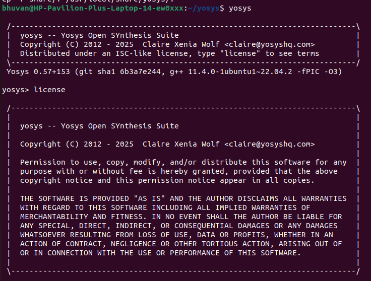
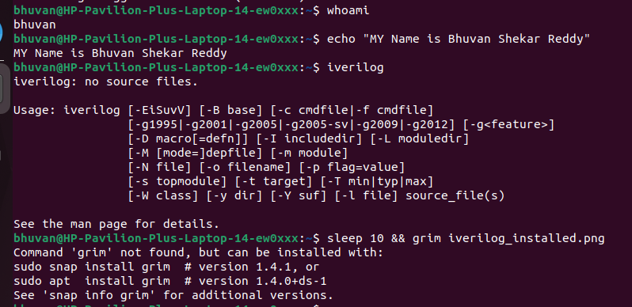
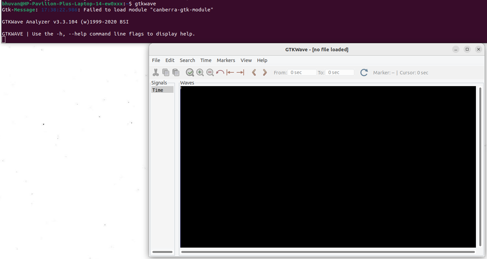

# sky2syn
Skywater to Synopsys
  <details>
<summary>Week_0</summary>
    
## Document
We are going to understand the given below process 
```
soft copy of the Hardware using RTL
              |
              | 
   ___________|_________________
   |                           |
   |                           |
 Processor               Peripherals/IPs
   |                           |
   |                           |
 Gate Level              ______|_____
  Netlist                |          |
                      Macros       Analog IPs
```


Using the small part(blue block) which has basic gates, transistors, IPs etc. This create GDSII sent to factory which is Tape-in we get the chips out which is called Tape-out by this we are going to get the chip for that we are going to provide the peripherals for the chip which is taped-out once we get the chip we can interface with different equipments which can work under 100Mhz to 130Mhz like Arduino boards, TV pannels, AC applications etc..

## Yosys
```
$ git clone https://github.com/YosysHQ/yosys.git
$ cd yosys 
$ sudo apt install make (If make is not installed please install it) 
$ sudo apt-get install build-essential clang bison flex \
    libreadline-dev gawk tcl-dev libffi-dev git \
    graphviz xdot pkg-config python3 libboost-system-dev \
    libboost-python-dev libboost-filesystem-dev zlib1g-dev
$ make 
$ sudo make install


bhuvan@HP-Pavilion-Plus-Laptop-14-ew0xxx:~/yosys$ yosys

 /----------------------------------------------------------------------------\
 |  yosys -- Yosys Open SYnthesis Suite                                       |
 |  Copyright (C) 2012 - 2025  Claire Xenia Wolf <claire@yosyshq.com>         |
 |  Distributed under an ISC-like license, type "license" to see terms        |
 \----------------------------------------------------------------------------/
 Yosys 0.57+153 (git sha1 6b3a7e244, g++ 11.4.0-1ubuntu1~22.04.2 -fPIC -O3)

yosys> license 

 /----------------------------------------------------------------------------\
 |                                                                            |
 |  yosys -- Yosys Open SYnthesis Suite                                       |
 |                                                                            |
 |  Copyright (C) 2012 - 2025  Claire Xenia Wolf <claire@yosyshq.com>         |
 |                                                                            |
 |  Permission to use, copy, modify, and/or distribute this software for any  |
 |  purpose with or without fee is hereby granted, provided that the above    |
 |  copyright notice and this permission notice appear in all copies.         |
 |                                                                            |
 |  THE SOFTWARE IS PROVIDED "AS IS" AND THE AUTHOR DISCLAIMS ALL WARRANTIES  |
 |  WITH REGARD TO THIS SOFTWARE INCLUDING ALL IMPLIED WARRANTIES OF          |
 |  MERCHANTABILITY AND FITNESS. IN NO EVENT SHALL THE AUTHOR BE LIABLE FOR   |
 |  ANY SPECIAL, DIRECT, INDIRECT, OR CONSEQUENTIAL DAMAGES OR ANY DAMAGES    |
 |  WHATSOEVER RESULTING FROM LOSS OF USE, DATA OR PROFITS, WHETHER IN AN     |
 |  ACTION OF CONTRACT, NEGLIGENCE OR OTHER TORTIOUS ACTION, ARISING OUT OF   |
 |  OR IN CONNECTION WITH THE USE OR PERFORMANCE OF THIS SOFTWARE.            |
 |                                                                            |
 \----------------------------------------------------------------------------/


yosys> 

 ```


## Iverilog
```
$ sudo apt-get install iverilog


bhuvan@HP-Pavilion-Plus-Laptop-14-ew0xxx:~$ iverilog
iverilog: no source files.

Usage: iverilog [-EiSuvV] [-B base] [-c cmdfile|-f cmdfile]
                [-g1995|-g2001|-g2005|-g2005-sv|-g2009|-g2012] [-g<feature>]
                [-D macro[=defn]] [-I includedir] [-L moduledir]
                [-M [mode=]depfile] [-m module]
                [-N file] [-o filename] [-p flag=value]
                [-s topmodule] [-t target] [-T min|typ|max]
                [-W class] [-y dir] [-Y suf] [-l file] source_file(s)

See the man page for details.
```




## GTKWave
```
$ sudo apt update 
$ sudo apt install gtkwave


bhuvan@HP-Pavilion-Plus-Laptop-14-ew0xxx:~$ gtkwave
Gtk-Message: 21:42:49.369: Failed to load module "canberra-gtk-module"

GTKWave Analyzer v3.3.104 (w)1999-2020 BSI

GTKWAVE | Use the -h, --help command line flags to display help.
```


  </details>
  
  <details>
<summary>Week_1</summary>
  <details>
<summary>Day_1</summary>
  <details>
<summary>Intro to Iverilog</summary> 
    
## Simulation
  ```
Checking of design is done by simulation.
We are going to use iverilog simulator to simulate the design.
```
## Design
    
Design is the actual verilog code or set of verilog codes which has the intended functionality to meet with the required specification.

## Test Bench
```
TB(Test Bench) is used to check whether it obey required specifications or not.
We have to apply stimulus(test_verilog) to the design and have to observe output and check whether it matches with specifications or not.
```
## How Simulation Works

First simulator checks for the changes on the input. Upon change to the input the output is evaluated. If no change to input no change in output.
``` 
 ----------            --------            ----------
|          | Primary  |        |  Primary |          |
|Stimulus  |--------->| Design |--------->|Stimulus  |
| Generator|--------->|        |--------->| Obeserver|
|          |  inputs  |        | outputs  |          |
 ----------            --------            ----------

we have to instantiate Design in TB then we have availability to apply stimulus(test_cases)
Design may have 1 or more primary inputs & outputs
```
## Iverilog Basic Flow
```
   Design--------
                 |
                 |----->Iverilog Simulator---->.vcd file----->gtkwave---->Output Wave form
                 |                              
   Test Bench----

1 We give design and tb to iverilog simulator for checking specifications.
2 iverilog simulator only checks changes in input if there are changes in input we gona dump the chnages in output.
3 .vdc file(Value_Change_Dump format) is a output file which is used to check the changes in the output.
4 gtkwave is used to map the output changes in form of a wave.
```
  </details>


  <details>
<summary>How to use Iverilog and GTKWave</summary>

  ## Getting all files related to Iverilog
  First open terminal and clone git
  ```
$ sudo -i
# go to the directory where you want to paste the librays and verilog codes using git
~# git clone https://github.com/kunalg123/sky130RTLDesignAndSynthesisWorkshop.git
```
We got all verilog files and librarys required to perform iverilog simulation

## Knowing how gtkwave and iverilog works
After cloning the git go to sky130RTLDesignAndSynthesisWorkshop -----> verilog_files directory
```
$sudo -i
#change the directory where sky130RTLDesignAndSynthesisWorkshop file exists
~# cd sky130RTLDesignAndSynthesisWorkshop/ verilog_files/
# in verilog_files we have all design related files and test benches for the respective design file
# now invoking the iverilog
~# iverilog design_file.v tb_design_file.v
# in this we are providing design and testbench of respective design file for simulation
~# ./a.out # for geting .vcd file for checking output
~# gtkwave tb_design_file.vcd # this gives the output wave form

```
```
bhuvan@HP-Pavilion-Plus-Laptop-14-ew0xxx:~$ sudo -i
[sudo] password for bhuvan: 
root@HP-Pavilion-Plus-Laptop-14-ew0xxx:~# cd /home/bhuvan/
root@HP-Pavilion-Plus-Laptop-14-ew0xxx:/home/bhuvan# ls
Bhuvan     Downloads  Public                               sky2syn    Videos
Desktop    Music      README.md                            snap       yosys
Documents  Pictures   sky130RTLDesignAndSynthesisWorkshop  Templates
root@HP-Pavilion-Plus-Laptop-14-ew0xxx:/home/bhuvan# cd sky130RTLDesignAndSynthesisWorkshop/verilog_files/
root@HP-Pavilion-Plus-Laptop-14-ew0xxx:/home/bhuvan/sky130RTLDesignAndSynthesisWorkshop/verilog_files# ls
a.out                    partial_case_assign.v
bad_case_net.v           pattern_detect_fsm_bad_style.v
bad_case.v               pattern_detect_fsm.v
bad_counter.v            rca.v
bad_latch_2.v            ripple_counter.v
bad_latch_net.v          tb_bad_case.v
bad_latch.v              tb_bad_counter.v
bad_mux_net.v            tb_bad_latch2.v
bad_mux.v                tb_bad_latch.v
bad_shift_reg2.v         tb_bad_mux.v
bad_shift_reg.v          tb_bad_shift_reg2.v
blocking_caveat_net.v    tb_bad_shift_reg.v
blocking_caveat.v        tb_blocking_caveat.v
comp_case.v              tb_comp_case.v
counter_opt2.v           tb_counter_opt.v
counter_opt.v            tb_demux_case.v
demux_case.v             tb_demux_generate.v
demux_generate.v         tb_dff_asyncres_syncres.v
dff_ares.net.v           tb_dff_asyncres.v
dff_asyncres_net.v       tb_dff_async_set.v
dff_asyncres_syncres.v   tb_dff_const1.v
dff_asyncres.v           tb_dff_const2.v
dff_async_set.v          tb_dff_const3.v
dff_const1.v             tb_dff_const4.v
dff_const2.v             tb_dff_const5.v
dff_const3.v             tb_dff_syncres.v
dff_const4.v             tb_good_counter.v
dff_const5.v             tb_good_latch.v
dff_net.v                tb_good_mux.v
dff_syncres.v            tb_good_mux.vcd
fa.v                     tb_good_shift_reg.v
good_counter.v           tb_incomp_case.v
good_latch.v             tb_incomp_if2.v
good_mux_netlist.v       tb_incomp_if.v
good_mux.v               tb_multiple_modules.v
good_shift_reg.v         tb_mux_generate.v
incomp_case.v            tb_opt_check2.v
incomp_if2.v             tb_opt_check3.v
incomp_if.v              tb_opt_check.v
mul2_net.v               tb_partial_case_assign.v
mult_2.v                 tb_pattern_detect_fsm.v
mult_8.v                 tb_rca.v
multiple_module_opt2.v   tb_ripple_counter.v
multiple_module_opt.v    tb_ternary_operator_mux.v
multiple_modules_flat.v  tb_upcntr.v
multiple_modules_hier.v  tb_up_dn_cntr.v
multiple_modules.v       tb_up_dn_cntr_with_load.v
mux_generate.v           tb_up_dn_cntr_with_load_with_start_stop.v
mux_spice.v              ternary_operator_mux_net.v
net.v                    ternary_operator_mux.v
opt_check2.v             upcntr.v
opt_check3.v             up_dn_cntr.v
opt_check4.v             up_dn_cntr_with_load.v
opt_check.v              up_dn_cntr_with_load_with_start_stop.v
root@HP-Pavilion-Plus-Laptop-14-ew0xxx:/home/bhuvan/sky130RTLDesignAndSynthesisWorkshop/verilog_files# iverilog good_mux.v tb_good_mux.v 
root@HP-Pavilion-Plus-Laptop-14-ew0xxx:/home/bhuvan/sky130RTLDesignAndSynthesisWorkshop/verilog_files# ./a.out 
VCD info: dumpfile tb_good_mux.vcd opened for output.
root@HP-Pavilion-Plus-Laptop-14-ew0xxx:/home/bhuvan/sky130RTLDesignAndSynthesisWorkshop/verilog_files# gtkwave tb_good_mux.vcd 
Gtk-Message: 23:59:17.901: Failed to load module "canberra-gtk-module"

GTKWave Analyzer v3.3.104 (w)1999-2020 BSI


(gtkwave:10340): dconf-WARNING **: 23:59:17.916: failed to commit changes to dconf: Failed to execute child process ?dbus-launch? (No such file or directory)
[0] start time.
[300000] end time.

(gtkwave:10340): dconf-WARNING **: 23:59:18.099: failed to commit changes to dconf: Failed to execute child process ?dbus-launch? (No such file or directory)

(gtkwave:10340): dconf-WARNING **: 23:59:18.099: failed to commit changes to dconf: Failed to execute child process ?dbus-launch? (No such file or directory)
```


